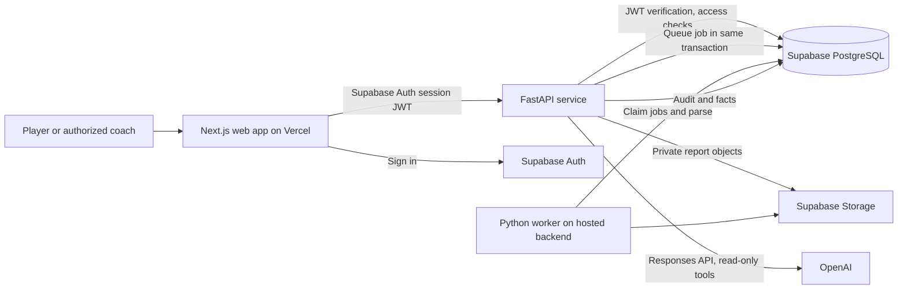

# PlayerIQ — V1 Product and Technical Specification

- **Status:** Phases 1–5.5 are implemented, including explicit source identity and a personal-first/team workspace. Deployment remains planned.
- **Date:** 2026-10-02
- **Audience:** Product, frontend, backend, data, and AI developers.

## 1. Purpose and V1 boundary

PlayerIQ turns GPS reports into a reliable personal history, deterministic performance summaries, and an AI explanation grounded in that history. A source report may list multiple athletes; each athlete row becomes a player's session only after an explicit authorized link. Phase 5.5 adds a small team workspace with player, coach, and admin membership approval. Personal analytics and AI remain player-scoped; team pages project accepted linked sessions from the same canonical records. Existing individual coach read grants remain separate from team membership. See [PLAYER_IDENTITY.md](PLAYER_IDENTITY.md) for the implemented identity and team contract.

The core promise is **traceable numbers**. Extraction may fail visibly; an unsupported or ambiguous value must not become a metric. SQL/Python functions calculate all numerical results. The LLM selects read-only tools and explains their outputs. It cannot query arbitrary SQL, calculate statistics, write data, or make medical or injury diagnoses.

### Implemented backend scope through Phase 5

The backend supports the reviewed Activity Report PDF layout only. It verifies Supabase asymmetric JWTs, stores uploads in a private bucket, processes durable ingestion jobs with a restricted worker role, presents uploader-only candidate rows, and links one `ready` row at a time after authorization. A private-report uploader may link an owned player. A team-report uploader who is a coach/admin may link an active team member. Explicit “This is me” or team-manager confirmation can establish a scoped, auditable source identity; later exact matches are recognition proposals and still require link confirmation. Accepted athlete metrics retain source-observation IDs; `zero_recorded` and row-level `needs_review` remain unlinked. Phase 3 provides chart review and `analytics_v1`; Phase 5 provides grounded AI, creator-private chat, and the global budget. Coach invitations, CSV, membership revocation, and delete/retention flows remain future work. See [AUTH.md](AUTH.md), [INGESTION.md](INGESTION.md), [PLAYER_IDENTITY.md](PLAYER_IDENTITY.md), and [AI_ANALYST.md](AI_ANALYST.md).

### Implemented web scope through Phase 5

`apps/web` is a Next.js App Router, strict TypeScript, Tailwind web client. Supabase JS owns browser sign-in, signup, session persistence, and refresh. The client sends a fresh Supabase access token to FastAPI for every request; FastAPI remains the access decision and analytical calculation boundary. The authenticated shell puts My Dashboard, My Sessions, Analytics, and AI Analyst first, followed by Team Dashboard, Team Sessions, Players, Team Reports, and My Reports. It supports team creation/join approval, explicit athlete identity confirmation, review, source identity status/revocation, and manager team assignment of old reports. Personal views use the account-owned player even if other player read grants exist. The frontend uses backend `analytics_v1` decimal-string facts and never computes comparisons, slopes, records, or MAD scores. Missing values stay distinct from zero. The desktop layout uses a dark navy sidebar and light analytical workspace; smaller viewports use a mobile drawer and scrollable tables.

The report viewer obtains the private PDF with the uploader's Bearer token and displays a temporary browser Blob URL, revoked when closed. This is a local view, not a public Storage URL. The only frontend environment values are the public Supabase URL/key and API origin. The first browser smoke test covered the sign-in screen at desktop and mobile sizes; `/readyz` confirmed the local backend's development database connection. A confirmed PlayerIQ Dev Auth user is still needed for an authenticated live browser journey because email confirmation is enabled; see [README.md](../README.md) for exact steps. Phase 5 adds the AI Analyst and chat UI on top of this Phase 4 baseline.

The Phase 2 migration grants restricted API/worker roles, revokes browser grants on the private schema, adds RLS policies, and forces RLS on domain tables. A follow-up migration secures Alembic's public version table. Phase 3 migration `0005` adds chart review audit and narrow update policies. The schema and policy metadata were verified in the PlayerIQ development Supabase project; distinct restricted runtime logins and a read-only live RLS test pass. Authenticated end-to-end HTTP requests still need verification with a development user. `/readyz` checks the database and restricted API-role membership.

### V1 acceptance criteria

1. A signed-in player or authorized team manager uploads the supported Activity Report PDF, sees a processing state and validation findings, then explicitly links an eligible athlete row. The same team PDF may yield several separately authorized player sessions. CSV remains future work.
2. Accepted player sessions have normalized metric values, units, source evidence, and a local activity date. Repeated identical uploads or row-to-player links do not create duplicate sessions. Zero-activity and suspect rows remain unaccepted until reviewed.
3. The dashboard shows recent sessions, metric trends, personal bests, and workload outliers with explicit sample sizes and definitions. Maximum Velocity and Player Load are priority cards when exact, reviewed athlete values exist; otherwise they show an explicit unavailable state.
4. The latest session has an AI explanation whose quantitative claims resolve to backend facts and source sessions.
5. Chat answers the example questions in this document, or clearly states that the available data cannot answer them.
6. Authorization tests show that an unrelated account cannot see reports, metrics, chat, analyses, or raw files.
7. A prompt injection inside a report or chat cannot cause unauthorized tool calls or unsupported numbers to appear in an answer.

### Out of scope for V1

Bulk roster imports, team AI, cross-player rankings, multi-provider equivalence claims, GPS raw-trace analysis, OCR of scanned PDFs, medical or injury risk prediction, training prescriptions, live device integrations, and an arbitrary report parser. The adapter interface allows later provider modules without changing the canonical metric model.

## 2. Architectural decisions

| Concern | V1 decision and reason |
|---|---|
| Frontend | Next.js App Router, TypeScript, Tailwind CSS. It handles authenticated pages and calls the Python API; it does not implement metric calculations. |
| Backend | FastAPI with Pydantic request/response models and domain services for ingestion, authorization, analytics, and AI orchestration. This keeps HTTP, parsing, calculations, and persistence separate. |
| Data | Supabase PostgreSQL is the source of truth; Supabase Auth manages identities; a private Supabase Storage bucket holds originals. Browser code receives only the Supabase publishable key and public configuration. |
| Background work | A separate Python worker claims rows from a Postgres-backed job table with `FOR UPDATE SKIP LOCKED`. This avoids running PDF parsing or AI generation within an HTTP request and avoids a second queue service in V1. |
| AI | The FastAPI service calls the OpenAI Responses API with strict, read-only function schemas. It executes requested functions itself and persists the tool audit trail. |
| Deployment | Vercel hosts web; a managed container host such as Render, Fly.io, or Railway hosts the API and worker in the same region as Supabase where practical. Separate processes may share one image. |
| Python libraries | pandas is for parser tabular normalization and bounded analytical frames. Simple aggregates remain SQL/domain functions. scikit-learn is deliberately not needed for V1's explainable robust outlier rule. |

Implemented repository layout: `apps/web` (authenticated UI and typed API client), `apps/api` (HTTP routes, domain services, repositories, and PDF adapter), `db/migrations`, tests, and docs. The ingestion worker is a separate Python CLI process in `apps/api`. The TypeScript API contracts are maintained against FastAPI OpenAPI; only the backend metric registry and analytics domain calculate performance facts.

### Trust and authorization boundary

Supabase Auth issues the access JWT. FastAPI verifies signature against the project JWKS, issuer, audience, expiration, and subject, with bounded JWKS caching and rotation handling; no claim from editable user metadata authorizes data access. Personal player routes require owner or an active individual coach read grant. Team routes require active membership, and coach/admin operations require explicit manager authorization. Raw report review and file routes still require the uploader even after team assignment. The API uses parameterized SQL through a dedicated restricted database role. The private `playeriq` schema is not exposed through Supabase Data API. Forced RLS checks the transaction-local verified actor ID; new team/identity tables have no browser-role grants and no worker access. The worker has a separate server-only role for jobs and ingestion.

Only the API/worker can access the report bucket. Uploads pass through the API after authorization, so storage paths cannot serve as an access decision. A team PDF can expose other athletes: raw-file download and unlinked source rows are available only to the uploader, while a linked player sees only their own accepted session metrics and provenance summary. The raw download endpoint checks uploader identity and streams the private object. Active individual coach grants are checked in the database on each player request.

### Configuration and operations

Secrets (`OPENAI_API_KEY`, database role passwords, Supabase server-side storage credential, invitation email provider key) are server-only environment variables in the backend host. Web environment variables are limited to the Supabase URL, publishable key, and public API origin. Separate dev/staging/prod projects and credentials. Pin dependencies and lockfiles. Use structured logs with `request_id`, `job_id`, `player_id`, and error code; never log JWTs, report text, OpenAI keys, or full chat content. Add health/readiness checks, migration deployment, database backups, upload retention/deletion policy, bounded retries, and basic alerting on job failures and AI error rate. Use rate limits and per-player upload/chat quotas.

## 3. Data model and schema

Use UUID primary keys and UTC `timestamptz` timestamps throughout. Use `text` for names/keys with explicit length checks; `bigint` for byte counts; `integer` for counts, durations, and retry attempts; and `numeric(12,3)` for distance/speed measurements, not binary floats. Hashes use fixed-length lowercase hex `char(64)`; JSON objects use `jsonb`. Application enums are enforced by database `CHECK` constraints and typed Python/TypeScript definitions. Migrations create explicit indexes and RLS policies. Foreign keys include `ON DELETE` behavior documented in migrations; deletes that affect metric history must invalidate dependent analyses.

| Table | Essential columns and constraints | Purpose |
|---|---|---|
| `profiles` | `user_id uuid PK -> auth.users`, `display_name text`, `timezone text` (validated IANA), `created_at timestamptz`, `updated_at timestamptz` | App preferences; no authorization role in editable profile fields. |
| `players` | `id uuid PK`, `owner_user_id uuid -> auth.users NOT NULL`, `display_name text`, `created_at timestamptz`, `archived_at timestamptz NULL`; V1 `UNIQUE(owner_user_id)` | One owned player record per player account. An owner controls sharing. |
| `coach_invitations` | `id uuid PK`, `player_id uuid FK`, `email_normalized text`, `token_hash char(64) UNIQUE`, `expires_at timestamptz`, `accepted_by_user_id uuid NULL`, `status text`, `created_at timestamptz`; pending invite uniqueness per player/email | Owner-issued, single-use, expiring coach invitation sent through a server-side email provider. Acceptance requires authenticated email verification and a matching normalized email. No raw token stored. |
| `player_coaches` | `(player_id uuid, coach_user_id uuid) PK`, `granted_at timestamptz`, `revoked_at timestamptz NULL`, `invitation_id uuid FK` | Active grant when `revoked_at IS NULL`. Only owner creates/revokes via service flow. |
| `report_uploads` | `id uuid PK`, `uploaded_by_user_id uuid`, `team_id uuid NULL`, `storage_key text UNIQUE`, `original_filename text`, `mime_type text`, `byte_size bigint`, `sha256 char(64)`, `status text`, `parser_key text NULL`, `parser_version text NULL`, `error_code text NULL`, `created_at timestamptz`, `processed_at timestamptz NULL`; partial unique `(uploaded_by_user_id, sha256)` for nondeleted uploads | One private original and ingestion lifecycle. Optional explicit team assignment affects accepted-session projection, never raw-file access. |
| `ingestion_jobs` | `id uuid PK`, `upload_id uuid UNIQUE FK`, `status text`, `attempts integer`, `next_attempt_at timestamptz`, `locked_at timestamptz NULL`, `last_error_code text NULL`, `created_at timestamptz`, `updated_at timestamptz` | Durable, retryable parsing queue. |
| `activity_reports` | `report_upload_id uuid PK/FK`, `source_activity_id text NULL`, `source_title text`, `source_team_name text NULL`, `source_venue_name text NULL`, `reported_local_datetime timestamp NULL`, `timezone text NULL`, `activity_total_time_s integer NULL`, `reported_athlete_count integer NULL` | Report-level metadata. A clock time without timezone or confirmed meaning is not silently converted to UTC. |
| `report_periods` | `id uuid PK`, `report_upload_id uuid FK`, `ordinal integer`, `source_label text`, `start_local time NULL`, `duration_s integer NULL`, `reported_athlete_count integer NULL`; unique `(report_upload_id, ordinal)` | Source period metadata and aggregates, separate from athlete exposure. |
| `source_athlete_rows` | `id uuid PK`, `report_upload_id uuid FK`, `row_ordinal integer`, `source_name text`, `source_position_code text NULL`, `participation_state text`; unique `(report_upload_id, row_ordinal)` | Listed source athletes, including zero-recorded rows. Name alone never assigns a row to a player profile. |
| `source_metric_observations` | `id uuid PK`, exactly one report/period/athlete-row parent FK, `source_label text`, `raw_value text`, `raw_unit text NULL`, `parsed_value numeric(12,3) NULL`, `source_locator text`, `quality_state text`, `parser_version text` | Exact source evidence at its true scope, including chart-only values, team averages, and ambiguous percentages. |
| `ingestion_findings` | `id uuid PK`, `report_upload_id uuid FK`, `code text`, `message text`, `severity text`, `scope text`, `row_ordinal integer NULL`, `metric_key text NULL`, `source_locator text NULL`, `created_at timestamptz` | Persistent extraction and validation findings for review. Added in Phase 1 because row quality alone cannot explain why a value was held. |
| `player_sessions` | `id uuid PK`, `player_id uuid FK`, `report_upload_id uuid FK`, `team_id uuid NULL`, `source_athlete_row_id uuid UNIQUE FK`, `link_method text` (`manual`/`recognized`), `source_identity_id uuid NULL`, `local_date date`, `started_at timestamptz NULL`, `athlete_duration_s integer NULL`, `session_type text` (`training`/`match`/`unknown`), `quality_state text`, `created_at timestamptz` | Canonical accepted athlete session. Its report/team references support group projections without copying metrics. Unknown type/time/duration remain unknown. |
| `session_metric_values` | `(player_session_id uuid, metric_key text) PK`, `value numeric(12,3)`, `unit text`, `source_observation_id uuid FK`, `definition_id text NULL`, `comparability_key text`, `quality_state text` | Normalized athlete metrics with provenance and definition-aware comparisons. Whole-number count checks apply by metric key. |
| `ai_runs` | `id uuid PK`, `player_id uuid FK`, `actor_user_id uuid`, `kind text` (`session_analysis`/`chat`), `session_id uuid NULL`, `message_id uuid NULL`, `status text`, `model text`, `prompt_version text`, `data_fingerprint char(64)`, `evidence_snapshot jsonb`, `response_json jsonb NULL`, `input_tokens integer NULL`, `output_tokens integer NULL`, `error_code text NULL`, timestamps | Reproducible AI request record. `data_fingerprint` identifies the ordered set of underlying session/metric versions. |
| `ai_tool_calls` | `id uuid PK`, `ai_run_id uuid FK`, `provider_call_id text`, `tool_name text`, `arguments_json jsonb`, `result_json jsonb`, `result_hash char(64)`, `status text`, `duration_ms integer`, `created_at timestamptz`; unique `(ai_run_id, provider_call_id)` | Audit of every requested and executed tool, including denied/failed calls. Store bounded results and restrict access. |
| `chat_threads` | `id uuid PK`, `player_id uuid FK`, `created_by_user_id uuid`, `title text`, `created_at timestamptz`, `updated_at timestamptz` | Player-scoped chat; each thread is private to its creator. A coach can only see their own chat while their grant is active. |
| `chat_messages` | `id uuid PK`, `thread_id uuid FK`, `role text` (`user`/`assistant`), `content_json jsonb`, `ai_run_id uuid NULL`, `created_at timestamptz` | Content blocks and fact references. Never treat old assistant text as current evidence. |
| `teams`, `team_memberships`, `team_manager_grants`, `team_join_requests` | Team UUID/name/creator; membership `(team_id,user_id)` with player/coach/admin role and optional player UUID; manager grant lookup; pending request with actor, player, display snapshot and decision audit | Small explicit team authorization boundary. Creator approves requests; the manager lookup avoids recursive RLS policies. |
| `player_source_identities` | Player/team, scope key, parser key, normalized and original label, confirmed source row, confirmer, timestamp and revocation | Auditable confirmation evidence. Unique active `(scope_key,parser_key,normalized_label)`; no globally unique athlete display name. |

Indexes: `(player_id, local_date DESC, id DESC)` on player sessions; `(uploaded_by_user_id, created_at DESC)` on report uploads; `(player_id, created_at DESC)` on AI runs; active coach lookup by `(coach_user_id, player_id)`; due-job lookup by `(status, next_attempt_at)`; thread messages by `(thread_id, created_at, id)`. Commit each authorized row-to-player link, accepted session metrics, and source references atomically. Reject a second link for the same source row or a conflicting activity/athlete identity for the same player; never silently overwrite history. A missing stable provider athlete ID means name matching cannot deduplicate or assign rows. Duplicate file hashes and same-player/date candidates trigger review, not an unsafe automatic merge.

Phase 1 migrations create the private schema with RLS enabled and no application policies; database access remains server-side and policies are added with authenticated operations. Their foreign keys use the database default `NO ACTION`, so a referenced record cannot be deleted while dependent rows remain. The implementation uses bounded `varchar` columns for labels and SHA-256 hex rather than unconstrained `text`/`char(64)`; the uploader-scoped duplicate check validates lowercase 64-character hashes before lookup.

### Ownership and retention

Phase 5.5 implements revocation of a confirmed source identity only. That stops future recognition and leaves accepted sessions intact. Coach/membership revocation, session or upload deletion, account deletion, and retention jobs remain future work. The retention periods for raw reports, unlinked parsed athlete rows, and AI audit records must be set before launch; backups remain subject to the host's retention period.

## 4. Canonical GPS metrics and definitions

The versioned metric registry (`metrics_v1`) is based on the reviewed real report in [GPS_DATA_MODEL.md](GPS_DATA_MODEL.md). The source distinguishes activity/period metadata, report aggregates, and athlete rows. There is **no per-athlete duration** in that PDF; `activity_total_time_s` must not populate `athlete_duration_s`. The report does not define any speed-zone, sprint, acceleration, or deceleration threshold. V1 does not impose the earlier hypothetical 19.8/25.2 km/h and ±3.0 m/s² definitions on this source.

| Athlete metric key | Unit | Source name and rule | V1 use |
|---|---|---|---|
| `total_distance_m` | m | `Distance (m)` in athlete table. | Primary workload/running-volume metric. |
| `reported_meterage_per_minute` | m/min | `Meterage Per Minute`; source-reported rate, athlete denominator unknown. | Primary intensity display, source-defined trend only. |
| `reported_high_speed_distance_m` | m | `High Speed Distance (m)`; threshold unknown. | Primary high-speed display with source-definition warning; compare only matching configurations. |
| `reported_accel_decel_efforts_combined` | count | `Accel&Decel Efforts`; combined efforts, thresholds unknown. | Primary workload count; no split into acceleration/deceleration. |
| `maximum_velocity_kmh` | km/h | `Maximum Velocity` is a chart-only value; accept only exact captured values that pass quality review. | Priority top-speed card, personal best, speed trend, speed-threshold query. |
| `reported_accel_decel_efforts_per_min` | count/min | `Accel&Decel Efforts Per Minute`; source-reported rate. | Session detail and compatible-source trend. |
| `velocity_band_2_distance_m`, `velocity_band_4_distance_m` | m | Source velocity bands; boundaries unknown. | Detail/AI only; band 4 is not relabeled sprint distance. |
| `reported_sprint_efforts` | count | `Sprint Efforts`; threshold/bout definition unknown. | Detail/AI only. |
| `player_load_reported` | source units | `Player Load` is chart-only; vendor formula and units unknown. Accept only exact, reviewed athlete values. | Priority workload card, source-specific trend and comparison; outlier analysis only with matching definition keys. |

`Overall (%)` in the athlete table is preserved as `source_overall_raw` with a quality warning and excluded from calculations: values under this percentage header may exceed 100. MD `Volume`, `Overall`, and `Intensity` gauges and their comparison percentages are report/period context, not personal session metrics. `Distance (m)` is required for an accepted active row; other fields can be null if absent or unextractable. A zero-filled row is held as `zero_recorded`, not accepted as a workout. A suspicious maximum-velocity label requires review before contributing to any record, trend, or outlier baseline.

The PDF adapter cannot read exact `Maximum Velocity` or `Player Load` values from the report's embedded chart images. The supplied workflow has PDF only, and page 2 visibly prints numeric labels above both bars for each athlete. Phase 3 adds uploader-only manual transcription and confirmation tied to a source athlete row UUID; it records the printed value, page/chart locator, reviewer, review time, state, and source observation. OCR is not implemented. The suspicious speed label in the reviewed report remains held even after transcription confirmation until supported evidence resolves it. Missing values remain null and produce explicit data-coverage messages; never infer them from other metrics or chart-bar height. This focused chart workflow does not add support for fully scanned reports.

Store exact source label, raw value/unit, page or row locator, definition/comparability key, and validation state. Convert units only when explicit. Never infer sprint distance, athlete duration, separate acceleration/deceleration counts, or universal speed thresholds from this report. More distance or high-speed work means **increased workload**, not automatically better performance. “Improved” is reserved for valid maximum velocity in V1. Unknown provider definitions limit cross-provider and sometimes same-provider comparisons; the API must return `not_comparable` rather than invent equivalence.

## 5. Deterministic analytics contract

All calculations use accepted, explicitly linked player sessions only, current player authorization, and compatible metric definitions. Team averages, unlinked rows, zero-recorded rows, and rows held for review are excluded. Order by confirmed `started_at` when available; otherwise use `local_date`. If two candidate sessions share a local date and have no confirmed ordering, return `ambiguous_order` for “latest,” “previous,” or “last” questions rather than choose an arbitrary ID. An `unknown` session type is not silently called training. Keep full precision in calculation and round only in response formatting (metres to nearest metre; km/h to one decimal; percentages to one decimal). API responses include raw value as a decimal string, display value, unit, sample size, date window, comparability/definition version, and source player-session IDs.

| Result | Exact V1 rule |
|---|---|
| Latest vs previous five | Latest unambiguously ordered accepted player session; compare each compatible metric against the arithmetic mean of up to five *preceding* accepted sessions with the same `session_type` value and comparability key. Report `latest − mean` and `(latest − mean) / mean × 100` only when `mean > 0`; otherwise percent is unavailable. Show `n`; say “limited history” when `n < 5`. Unknown-type sessions compare only with unknown-type sessions and are not called training. |
| Trend | For a requested player-local date range and metric, return ordered points and backend-calculated first-to-last absolute/percent change (`first > 0` for percent), plus a least-squares slope per calendar week only when at least three distinct session dates exist. No slope-based “improvement” claim for workload metrics. |
| Personal best | Maximum quality-accepted `maximum_velocity_kmh` across the player's sessions (and optional max total distance as “highest recorded workload,” not a performance best); return all tied session IDs, with earliest as display primary. Suspect chart values are excluded pending review. |
| Hardest training session | Default operational proxy: confirmed **training** session with highest `total_distance_m`; return its date, distance, and available source-defined high-speed/effort values. Explain that “hardest” means highest recorded total distance in V1. If no sessions have confirmed training type, ask for type confirmation or state that none are classified. An explicit metric in the question overrides this proxy. |
| Last exceeded speed | Latest unambiguously ordered session with valid `maximum_velocity_kmh > threshold` (strict `>`, not `>=`); include exact speed and session citation. Accept threshold only in km/h and within safe numeric bounds. Held or missing chart values never count. |
| Largest improvement | Among supported improvement metrics, V1 uses only valid `maximum_velocity_kmh`. Compare latest against previous-five mean when available; if change is not positive, report no demonstrated improvement by this definition. For “largest workload change,” rank absolute percentage changes across comparable `total_distance_m`, `reported_high_speed_distance_m`, `reported_accel_decel_efforts_combined`, and `player_load_reported` results; never relabel workload increases as improvement. |
| Workload outlier | For `total_distance_m` and, only with a matching definition key, `reported_high_speed_distance_m`, `reported_accel_decel_efforts_combined`, and reviewed `player_load_reported`, compare a session to the six prior accepted sessions of the same confirmed type within 60 player-local days. Require at least five valid comparable values. Compute median `M`, median absolute deviation `MAD`, and modified z-score `0.6745 × (value − M) / MAD`; flag high/low if `abs(score) >= 3.5`. If `MAD = 0`, return “insufficient variation,” not an outlier. Include baseline session IDs, `n`, and rule version. |

No cross-player ranking in V1. No diagnosis, injury probability, or readiness prescription is inferred from outliers. Missing metrics and short history are first-class results, never treated as zeros. Phase 3 implements the pure, strongly typed `analytics_v1` calculation layer behind repository and service layers, without FastAPI/auth dependencies in the domain. The reusable service can later be called by AI tools without duplicating arithmetic. Each result includes its rule version; overview/outlier responses include a fingerprint of accepted session dates, types, quality, metric values, definition keys, and source IDs. A later confirmed chart correction changes that fingerprint. No analytics result is persisted or cached yet.

## 6. API contract

Base path `/v1`; JSON responses except multipart upload and authorized raw-file download. Authenticated endpoints require `Authorization: Bearer <Supabase access JWT>`. Path `player_id` never implies permission. List endpoints use opaque cursors and capped `limit`; responses include `next_cursor`. Errors use `{ "error": { "code": "...", "message": "...", "request_id": "...", "details": {} } }` with safe, actionable messages. This table contains both implemented routes and future V1 targets; future routes are marked below.

| Method and path | Purpose and response |
|---|---|
| `GET /healthz`, `GET /readyz` | Process health and dependency readiness; no user data. |
| `GET /v1/me`, `PATCH /v1/me` | Profile and timezone preferences. Changing timezone affects future ingestion, not stored local dates. |
| `POST /v1/players`, `GET /v1/players`, `GET /v1/players/{player_id}` | Create own V1 record; list owned and coach-granted records; get player summary. |
| `POST /v1/players/{player_id}/coach-invitations` | Future: owner invitation and server-side email delivery. |
| `POST /v1/coach-invitations/accept` | Future: authenticated matching recipient accepts a single-use token. |
| `GET /v1/players/{player_id}/coaches`, `DELETE /v1/players/{player_id}/coaches/{user_id}` | Future: owner lists and revokes grants. |
| `POST /v1/report-uploads` | Authenticated multipart `file` and optional team UUID (manager only); 202 `{upload_id,status}` or 409 duplicate for uploader. Max 10 MB; supported PDF only. No player is assigned by name matching. |
| `GET /v1/report-uploads?limit=&cursor=` | Implemented uploader-only, cursor-paginated upload history and extracted row count when ready. |
| `GET /v1/report-uploads/{upload_id}` | Uploader-only processing status, report metadata, candidate athlete rows, per-row quality findings, and existing links. This endpoint may show teammate names, so it is not a player-scoped endpoint. |
| `GET /v1/report-uploads/{upload_id}/chart-reviews` | Implemented uploader-only review history for the report's two page-2 chart metrics. |
| `POST /v1/report-uploads/{upload_id}/chart-reviews` | Implemented proposal of an exact printed label for a selected ready source row UUID; does not accept the metric yet. |
| `POST /v1/report-uploads/{upload_id}/chart-reviews/{review_id}/confirm` | Implemented uploader confirmation of matching raw label; creates source observation and updates a linked session if accepted. Suspicious speed stays held. |
| `POST /v1/report-uploads/{upload_id}/links` | One `{source_athlete_row_id, player_id, session_type, source_identity_id?}` mapping. Uploader-owned player or assigned-team uploader/manager with active target membership. A supplied identity is revalidated; no automatic acceptance. |
| `POST /v1/report-uploads/{upload_id}/claim-as-self`, `POST /v1/report-uploads/{upload_id}/confirm-team-player` | Explicit exact-label source identity confirmation and safe row link. The latter is uploader-manager only for a team member. |
| `GET /v1/me/source-identities`, `POST /v1/me/source-identities/{id}/revoke` | Owner identity status/provenance and explicit recognition deactivation; accepted history remains. |
| `POST /v1/report-uploads/{upload_id}/team` | Uploader-manager explicitly assigns a private upload to a team after validating any existing linked players as members. |
| `GET/POST /v1/teams`, `GET /v1/teams/{id}`, `POST/GET /v1/teams/{id}/join-requests`, `POST /v1/teams/{id}/join-requests/{request_id}/approve` | Team discovery by membership, creation, private request by known team UUID, and creator-admin approval. |
| `GET /v1/teams/{id}/dashboard`, `/sessions`, `/sessions/{report_id}`, `/players`, `/players/{player_id}`, `/reports` | Bounded accepted team projections. Team player detail reuses `AnalyticsService` with team filter. Reports are sanitized manager-only metadata. |
| `GET /v1/report-uploads/{upload_id}/file` | Uploader-only short-lived download or stream of the entire raw report. Linked player access alone is insufficient. |
| `DELETE /v1/report-uploads/{upload_id}` | Future: authorized raw-report deletion and retention workflow. |
| `DELETE /v1/players/{player_id}/sessions/{session_id}` | Future: owner deletion and dependent analysis invalidation. |
| `GET /v1/players/{player_id}/sessions` | Cursor page with dates, type, quality, metric preview; filters `from`, `to`, `type`. |
| `GET /v1/players/{player_id}/sessions/{session_id}` | Only this player's metrics, units, provenance summary, and validation warnings; never exposes the other source athlete rows or raw team report. |
| `GET /v1/players/{player_id}/analytics/overview` | Latest comparison, confirmed Maximum Velocity record, highest recorded total-distance workload, hardest training session, and latest outlier flags from deterministic functions. |
| `GET /v1/players/{player_id}/analytics/trend?metric=&from=&to=&type=` | Ordered series with source session type and backend trend result. Validate metric against registry. |
| `GET /v1/players/{player_id}/analytics/outliers?type=&limit=` | Explainable workload flags and baselines. |
| `GET /v1/players/{player_id}/sessions/{session_id}/analysis` | Latest creator-private saved AI session analysis, with current/stale status. |
| `POST /v1/players/{player_id}/sessions/{session_id}/analysis` | Idempotent grounded AI analysis generation for an accepted session. |
| `POST /v1/players/{player_id}/chats`, `GET /v1/players/{player_id}/chats` | Creator-private AI chat threads, cursor paginated on read. |
| `GET /v1/players/{player_id}/chats/{thread_id}/messages` | Creator-private cursor-paginated chat history. |
| `POST /v1/players/{player_id}/chats/{thread_id}/messages` | Idempotent grounded AI response with fact registry and source links. |

Implemented mutations use bearer-token requests, idempotency where retries are likely, and per-player authorization checks. API schemas reject unknown enum values and invalid or unbounded implemented parameters. The web client's TypeScript response contracts are maintained against the FastAPI OpenAPI schema; automatic type generation remains a later tooling improvement.

## 7. Ingestion pipeline

### Supported formats

1. **Reviewed activity-report PDF layout v1:** the five-page example documented in [GPS_DATA_MODEL.md](GPS_DATA_MODEL.md) is the first target fixture. It contains multiple athlete rows and chart-only metrics. The future adapter must extract exact printed values and source locators, not estimate bar heights. Scanned/image-only PDFs receive `unsupported_scanned_pdf`; unknown layouts receive `unsupported_layout`.
2. **PlayerIQ canonical CSV v1:** one athlete session per file, UTF-8, documented header names, explicit units and any zone definitions, ISO 8601 timestamp with offset where available, and session type. A published sample template and fixture are implementation deliverables. It may be built after the real PDF adapter if implementation priorities require.

Adapters expose `detect`, `extract`, and `version` and return typed `RawReport`, `RawPeriod`, and `RawAthleteRow` structures with source locators (CSV column/row, PDF table cell, or exact chart label), raw units, and any stated definitions. A report may yield many rows; no row is automatically assigned by matching a name. Provider-specific adapters can later map into the same normalized metric registry. Uploaded report text is untrusted data and never enters system or developer AI instructions.

### State machine and processing steps

Report states: `received → queued → extracting → validating → awaiting_link` or `rejected` / `failed_retryable`. Each source athlete row has its own quality state (`ready`, `zero_recorded`, `needs_review`); each linked player session is `accepted` or `held`. Status transitions are recorded with timestamps and error codes. Held rows are excluded from analytics; review may involve correcting the source/reuploading or an authorized, audited quality resolution, never silent clipping.

1. API authenticates the uploader and checks content length, extension/MIME/magic bytes, and quota. It streams the file to a bounded temporary buffer, computes SHA-256, rejects duplicate bytes for that uploader, saves to the private bucket, then creates `report_uploads` and `ingestion_jobs`. Recover orphan objects if database commit fails.
2. Worker atomically claims a due job with row locking, downloads the exact object key, and selects a versioned adapter. Parsing runs with time/memory/page limits and no external links/macros. CSV formula-like content is treated as plain text. A malformed file cannot block the queue.
3. Extract report/period metadata and every listed athlete row at its true scope. Preserve raw values and locators; normalize only known units. The reviewed PDF has no athlete duration, timezone, session type, or zone thresholds; keep those unknown. Validate finite/nonnegative values, count integrality, cross-field distance bounds, zero rows, and suspect speed/effort clusters. A bad athlete row must not corrupt another row.
4. Return candidate rows to the uploader. Accept explicit row-to-player mapping only after checking access to each target player. Reject duplicate links and ambiguous identity. Commit a player session and its accepted metric values/provenance atomically. Held rows never enter calculations. Session type supplied by uploader is recorded as a confirmed user classification; otherwise it remains `unknown`.
5. Accepted links are immediately visible to the deterministic analytics service. The ingestion worker retries transient processing failures with a bounded attempt count; permanent parser/validation errors do not retry. Future AI generation and deliberate reprocessing revisions will use the player-history fingerprint to detect stale results.

Original raw files and unlinked teammate rows remain private to the uploader/processing service. No raw PDF text is sent to OpenAI by default; the AI sees only the authorized player's validated metrics, deterministic facts, limited metadata, and source IDs. This reduces accidental disclosure and report-borne prompt injection.

## 8. AI tool and analysis design

The model receives a short system policy, the current authorized player context, conversation context, and a finite list of **read-only** function tools. Tool schemas use strict JSON Schema with closed objects, required fields, bounded dates/limits, and metric enums. The backend supplies the `player_id` from authenticated route context, never trusts a model-provided player ID, rechecks authorization on each tool execution, and limits calls per run/time budget. The model cannot access database credentials, execute SQL/Python, or call external web tools.

| Tool | Inputs (besides server-bound player) | Deterministic output |
|---|---|---|
| `get_latest_session_comparison` | `session_type`, `previous_count` (1–5) | Latest accepted linked metrics, prior mean per matching definition, deltas where defined, `n`, session IDs or an ambiguity/insufficient-data status. |
| `get_metric_trend` | `metric_key`, `from_date`, `to_date`, `session_type` | Time-series points, first/last delta and optional slope only across comparable accepted values; sample/definition metadata. |
| `get_personal_records` | `metric_key` from allowed record metrics, optional `session_type` | Maximum, tied session IDs, date and unit. |
| `get_hardest_session` | `session_type` default confirmed training, `metric_key` default total distance | Highest clean linked session by chosen metric, explicit ranking rule and supporting values. |
| `get_last_speed_exceedance` | `threshold_kmh` | Latest strict exceedance from valid chart-reported maximum velocity, or `not_found`/`missing_metric`/`ambiguous_order`. |
| `get_largest_change` | `comparison` (`latest_vs_previous_five`), `kind` (`improvement`/`change`) | Allowed ranked changes with metric semantics and sample sizes. |
| `get_workload_outliers` | `session_id` optional, `session_type`, `limit` | Flags with median, MAD, score, baseline IDs, and insufficient-data outcomes. |
| `get_session_facts` | `session_id` | Only that linked player's validated row metrics and provenance references; no teammates or report aggregates. |

Every returned scalar fact has `fact_id`, `value` as a decimal string where applicable, `unit`, `rule_version`, `metric_definition`/comparability key, `source_session_ids`, and an explicit `status` (`ok`, `missing_metric`, `insufficient_history`, `not_found`, `not_comparable`, or `ambiguous_order`). Tools do the arithmetic and formatting; the model may choose which supported fact explains a question but cannot derive new numeric values. Model requests for unsupported metrics, undefined zones, team rows, or unauthorized sessions are denied and audited.

### Grounded response protocol

1. Create `ai_runs` with actor, player, model/prompt versions and current data fingerprint. For session analysis, request a fixed set of facts for that session and its prior comparable history. For chat, let the model select among the read-only functions.
2. Validate each function call; execute it; save name, validated arguments, result or error, timing, and source IDs in `ai_tool_calls`. Supply the exact structured result to the model. The model can make multiple bounded calls if needed.
3. Require structured output: short narrative blocks plus fact references such as `{fact_id: "f_..."}` and session citations. The model must write no free-form numerical literals in narrative text. The API resolves placeholders from the tool fact registry into rendered values. Unsupported fact IDs, uncited numerical tokens, wrong units, or diagnosis/prescription language fail validation; retry once with feedback, then return a deterministic evidence summary and an explicit analysis-unavailable message.
4. Persist the final response and evidence snapshot. Display source links to session detail and a “How calculated” panel. Do not present stale analysis after history changes; regenerate against the new fingerprint.

The system instruction forbids medical/injury diagnoses and says workload outliers are observations, not risk scores. Answers mention limitations when history is sparse, thresholds differ, or a requested metric is absent. A user can ask general football questions, but V1 chat should say it only answers questions supported by that player's GPS history; it must not invent external coaching advice. Model/provider errors return saved deterministic analytics without pretending AI succeeded.

### Required example behavior

- “Compare my latest session with my previous 5 sessions” → `get_latest_session_comparison(5)` and cite the latest and baseline session IDs.
- “How has my top speed changed this month?” → `get_metric_trend(maximum_velocity_kmh, player-local month start, today)`; backend supplies the change and `n` from quality-accepted chart values.
- “What was my hardest training session?” → `get_hardest_session(training, total_distance_m)` and state the distance-based definition.
- “When did I last exceed 30 km/h?” → `get_last_speed_exceedance(30.0)` with strict greater-than semantics on reviewed `Maximum Velocity` values; anomalous readings are not accepted exceedances.
- “Which performance metric improved the most?” → `get_largest_change(improvement)`; V1 can name top speed if positive, or explain that the other tracked metrics are workload quantities rather than performance improvements.

## 9. Pages and UI

| Route / view | Main content and states |
|---|---|
| `/` | Redirects to the authenticated app; the guard sends signed-out visitors to sign-in. A public landing page remains future work. |
| `/auth/sign-in`, `/auth/sign-up` | Supabase email/password forms and email-confirmation handoff. Invitation acceptance is future work. |
| `/app` | Authenticated dashboard with prominent guided identity onboarding below the hero when unconnected, reviewed metric cards, backend trend, records, recent sessions, and a distinct connected/no-history state. |
| `/app/connect` | Uploader-only report choices for identity selection; direct navigation only when one suitable report is known, actual processing states, upload fallback, and bounded older-history loading. |
| `/app/upload` | PDF drag/drop, client-side format/size feedback, transfer progress, and uploader-only paginated upload history. |
| `/app/uploads/[uploadId]` | Uploader-only report review with responsive self-selection cards, evidence confirmation, chart values, source recognition state, manager teammate confirmation, and optional team assignment. |
| `/app/sessions` | Paginated accepted player history with primary metric columns and missing indicators. |
| `/app/sessions/[sessionId]` | Linked player's accepted metric list, provenance references, validation notes, and an optional grounded AI explanation. No team PDF exposure. |
| `/app/analytics` | Backend metric trend with date/type selectors, accessible chart and underlying table, overview facts, and workload outliers. |
| `/app/profile` | Profile editing, owned player, connected source identity status and explicit revocation. |
| `/app/team`, `/app/team/sessions`, `/app/team/sessions/[reportId]`, `/app/team/players`, `/app/team/players/[playerId]`, `/app/team/reports` | Team creation/join/approval, accepted activity overview, report-grouped sessions, role-filtered player directory/drilldown, and sanitized manager report summaries. |

Phase 5 implements chat and AI interpretation in `/app/analyst`, with an analysis panel on accepted session detail. Public marketing, invitation acceptance, and data export/deletion UI remain future work.

Phase 5.6 reuses Phase 5.5 identity/link endpoints. Report choices require an eligible row and reported date, plus the existing team scope when assigned. Client checks guide navigation only; the server remains authoritative for duplicates, ambiguous labels/dates, conflicts, authorization, and accepted metrics. Source identities are never inferred from account names. After explicit confirmation, the client verifies a connected identity for the owned player, refreshes profile state, and navigates to `/app`, where accepted history is fetched anew. A verification failure retains a retryable error and does not claim success. This phase changes no schema, RLS, AI rules, or backend calculations. See [PLAYER_IDENTITY.md](PLAYER_IDENTITY.md) for pagination limits and manual verification.

Design direction: restrained sports analytics interface with strong typography, metric cards, legible charts, and distinct evidence/AI panels. Use responsive layouts and keyboard-accessible controls. Charts have text/table equivalents, units in labels, color-independent outlier indicators, and tooltips explaining definitions. The AI explanation is visually labeled as interpretation; computed values and cited sessions are separate, inspectable elements. Loading, partial-data, no-history, unsupported-report, and API-failure states must be designed, not left to generic error pages.

## 10. Testing and verification plan

| Layer | Required tests |
|---|---|
| Pure calculations | Unit and property tests for unit conversions, ordering/ties, latest-vs-five, zero denominator, missing values, date/timezone boundaries, personal best, strict speed exceedance, hardest-session filter, median/MAD outliers and `MAD=0`. Golden expected values independent of implementation. |
| Ingestion | Synthetic five-page PDF and canonical CSV fixtures; multiple athlete rows, zero-distance rows with a possible nonzero Player Load, multi-row linking, exact chart-label capture with athlete matching and reviewer confirmation, missing versus printed zero, missing athlete duration/timezone/type, unknown thresholds, anomalous `Overall (%)` and `Maximum Velocity` values, malformed/scanned PDF, duplicate hash/link, retry and idempotency behavior. |
| Database/security | Migration smoke tests; FK/unique/check constraints; RLS allow/deny matrix for owner, active coach, revoked coach, unrelated user, unauthenticated user, and worker; private storage authorization and signed URL expiry. |
| API | OpenAPI schema validation, authentication and 403/404 behavior, pagination/filter bounds, upload size/type handling, idempotent retries, stable error envelope. |
| AI orchestration | Fake OpenAI client tests for zero/multiple tool calls, strict argument rejection, out-of-scope player access, audit record persistence, unsupported facts, raw number rejection, stale fingerprint, prompt injection in report/chat, diagnosis refusal, timeout/fallback. |
| End-to-end | Player signup → report upload → explicit “This is me” confirmation → accepted session → dashboard/trend → AI answer with citation; team creation → second account requests membership → creator approves → manager links an eligible team row → authorized team drill-down. Verify one player never sees another athlete's uploader-only review or raw team PDF solely because their row was linked. Test responsive and keyboard paths with synthetic data. |
| Operational | Job crash/restart recovery, bounded retry, dependency outage, structured log redaction, backup restore rehearsal before production. |

CI gates: formatter/linter/type checker for Python and TypeScript, calculation/parser/security tests, migration checks, frontend build, and API contract compatibility. Seed only synthetic GPS reports in tests and demos. A release requires a manually checked answer set for the five example questions with source facts and an explicit check that no unsupported number is rendered.

## 11. Implementation sequence and open product decisions

Completed sequence: (1) report/athlete/player schema, access model, and metric registry; (2) worker and reviewed PDF adapter with synthetic fixture and explicit row link; (3) chart capture/review and deterministic analytics; (4) authenticated web client; (5) grounded AI Analyst, audit, and shared global budget; (5.2) focused automatic chart-label extraction; (5.5) confirmed source identities and personal/team projections. Phase 6 deployment and operational hardening remain future work. Canonical CSV and general OCR remain future ingestion work. Tests and demos use synthetic fixtures; the supplied original PDF is not modified.

Open decisions for future phases: the source vendor and metric/zone definitions (currently unavailable); whether the PDF header time is activity start and its timezone; the meaning of zero-filled rows and anomalous values; and report/audit retention and regional data residency requirements. See [GPS_DATA_MODEL.md](GPS_DATA_MODEL.md) for the public source-format model. The architecture does not depend on a particular provider or email vendor.

## 12. Reference documentation checked for this design

- [Supabase changelog](https://supabase.com/changelog.md) (checked 2026-09-29; recent database changes do not require an extension in this design).
- [Supabase JWT verification and JWKS](https://supabase.com/docs/guides/auth/jwts).
- [Supabase Row Level Security](https://supabase.com/docs/guides/database/postgres/row-level-security).
- [Supabase private Storage access control](https://supabase.com/docs/guides/storage/security/access-control).
- [OpenAI function calling and strict schemas](https://developers.openai.com/api/docs/guides/function-calling).

These links document the external platform choices. The analytics formulas above are **PlayerIQ V1 product definitions**; this report does not supply universal GPS-zone thresholds or provider equivalence.
